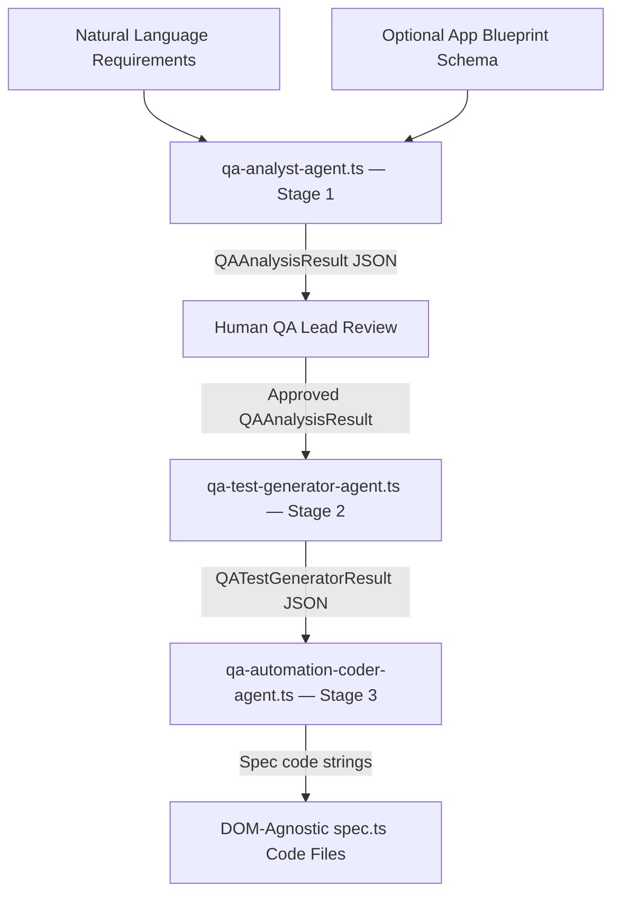

# QA workflow — deterministic engine layer

This directory houses the **deterministic TypeScript engine** that implements the QA pipeline computations programmatically. It is one half of the hybrid cognitive architecture:

| Layer | Location | Purpose |
|-------|----------|---------|
| **Cognitive (agent instructions)** | `qa/drumr-qa-engine.md` + `qa/agents/skills/` | Guides the LLM agent through each stage |
| **Deterministic (this directory)** | `qa/agents/qa-workflow/` | Implements the actual logic in TypeScript — classification, flow-step extraction, JSON output shaping |

The TypeScript files here are the programmatic backend. They can be called by a CLI tool, a GitHub Action runner, or any script that needs to produce structured `QAAnalysisResult` / `QATestGeneratorResult` JSON without going through a chat session. The skills in `qa/agents/skills/testing-qa-analyst/` describe the *same* logic as prose for an LLM to follow.

---

## Files

| File | Role |
|------|------|
| [`types.ts`](types.ts) | **Canonical type definitions** — `QAAnalysisResult`, `TestableBehavior`, `AmbiguityReport`, `AppMetadata`, etc. These are the shared contract between the cognitive and deterministic layers. |
| [`qa-analyst-agent.ts`](qa-analyst-agent.ts) | Implements Stage 1 programmatically: extracts testable behaviors, classifies criteria, detects ambiguities. |
| [`qa-test-generator-agent.ts`](qa-test-generator-agent.ts) | Implements Stage 2 programmatically: translates `QAAnalysisResult` into Gherkin-structured test case definitions. |
| [`qa-automation-coder-agent.ts`](qa-automation-coder-agent.ts) | Implements Stage 3 programmatically: compiles `QATestGeneratorResult` into DOM-agnostic Playwright spec code. |
| [`qa-workflow.test.ts`](qa-workflow.test.ts) | Jest unit tests for the TypeScript engine. Run these to verify the deterministic logic. |

---

## Pipeline flow



The cognitive layer (`drumr-qa-engine` agent + skills) follows the same pipeline but executed through a chat session. The deterministic layer (this directory) executes the same pipeline programmatically for CLI or CI use.

---

## Running the unit tests

The TypeScript engine is verified by Jest tests in [`qa-workflow.test.ts`](qa-workflow.test.ts):

```bash
cd apps/project-management-app/backend
TS_NODE_PROJECT=tsconfig.test.json npx jest --config config/jest.config.ts \
  --testPathPatterns='qa-workflow.test' --no-coverage --verbose
```

Tests cover: input validation, behavior classification priority (`permission` > `boundary` > `negative` > `positive`), verb-to-step mapping, and stemming normalization.

---

## Relationship to the cognitive layer

The skills under `qa/agents/skills/testing-qa-analyst/` describe the analyst stage as prose for an LLM. This directory implements the same logic in TypeScript for programmatic execution. The `types.ts` file is the shared contract — the JSON shapes it defines are what both layers produce and consume.

