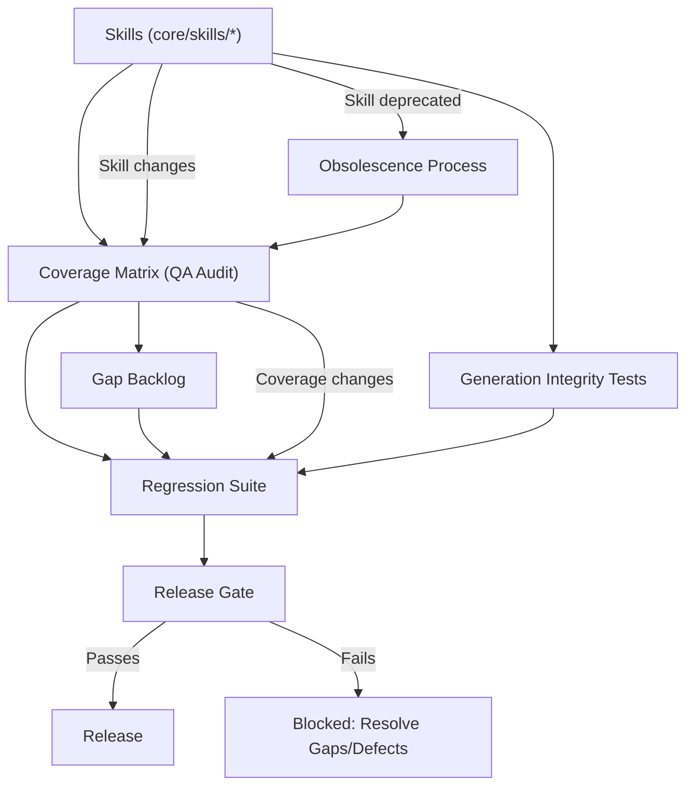

# Overview of the Test Plan

The goal of this plan is to ensure complete regression of the Drumr framework in every release, guaranteeing that all critical skills and their integrations are validated before release.

**Test types and relation to skills:**

- **E2E (Playwright + DrumrTestKit):** Validates `e2e-testable` skills and complete user flows.
- **Integration (DrumrIntegrationTestKit):** Validates `framework-internal` skills and backend/frontend layer collaborations.
- **Unit (DrumrUnitTestKit):** Validates internal contracts, helpers, and isolated logic of internal skills.
- **Generation Integrity:** Validates `generation-testable` skills — confirms that Copilot-generated code from a skill compiles, passes lint, and conforms to the skill's documented patterns without requiring Copilot to apply subsequent fixes.

The **gap backlog** and the **coverage matrix** of skills feed the regression set: every skill with incomplete coverage or open defects must have scenarios in the regression suite.

**Canonical artifacts for release QA:**

- Inventory, coverage, and gap backlog: `qa/conformance/skills-audit-result.md`
- Audit update prompt/process: `qa/docs/skills-audit.md`

---

## Regression Suite Management

**Regression test selection per release:**

- Includes all smoke and regression level tests for `core-flow` and `supporting` skills.
- Adds all historical bugfix and edge case scenarios documented in the gap backlog.
- Skills changed in the release → review gap backlog and coverage matrix, add new or update existing tests.

> **Prerequisite — Release trigger definition:** This process requires a formally defined Release Candidate signal (e.g. a git tag on `core/` + changelog entry). Until a release management process is in place, treat each merge to `develop` as a regression trigger and every sprint boundary as a regression window. See `qa/docs/qa-action-points.md` for the roadmap on establishing this.

**Operational process (mandatory) to prepare regression for each RC/release:**

1. Re-run the audit and update `qa/conformance/skills-audit-result.md`.
2. Build the release regression manifest using the QA Coverage Matrix from the audit.
3. Mandatorily include all `not-covered` and `partially-covered` entries for `e2e-testable` and `e2e-partial`, in the prioritized order of the gap backlog (risk -> business impact).
4. Include all historical bugfix scenarios for skills touched in the release.
5. For `framework-internal` skills impacted by the release, append their unit/integration/extension set as part of the gate.
6. Publish execution evidence and release gate decision (pass/fail) with explicit reference to each skill in the manifest.

**Prioritization rule for incremental selection (if time window is limited):**

- Priority 1: `risk=high` + `business_impact=core-flow`
- Priority 2: `risk=high` + `business_impact=supporting`
- Priority 3: rest of `core-flow`
- Priority 4: rest of `supporting` and `optional`

**Suite update:**

1. When a skill changes, update the coverage matrix.
2. Review the gap backlog for that skill.
3. Add or update the corresponding regression tests.
4. Mark the skill as covered in the regression checklist/table.

**Test obsolescence process:**

When a skill is deprecated or its public contract changes:

1. The framework maintainer notifies QA with the affected skill and description of the change.
2. QA reviews the coverage matrix and identifies the tests linked to that skill.
3. Deprecated skill tests are labeled as `obsolete` and removed from the active suite.
4. Tests for skills with modified contracts are updated or re-validated in the same change cycle.
5. If the replacement skill lacks equivalent coverage, it is recorded in the gap backlog.

**Checklist of skills covered in current regression:**

> The complete coverage table per skill is maintained in the canonical coverage audit (`qa/conformance/skills-audit-result.md`). The following table is the quick verification subset for releases.

| Skill                    | Test scope             | Covered in regression? |
|--------------------------|------------------------|------------------------|
| **E2E / observable**     |                        |                        |
| backend-actions          | e2e-testable           | [ ] Yes / [ ] No       |
| backend-api              | e2e-testable           | [ ] Yes / [ ] No       |
| backend-auth             | e2e-testable           | [ ] Yes / [ ] No       |
| backend-components       | e2e-testable           | [ ] Yes / [ ] No       |
| backend-datamodels       | e2e-testable           | [ ] Yes / [ ] No       |
| backend-files            | e2e-testable           | [ ] Yes / [ ] No       |
| frontend-action-views    | e2e-testable           | [ ] Yes / [ ] No       |
| frontend-api             | e2e-testable           | [ ] Yes / [ ] No       |
| frontend-components      | e2e-testable           | [ ] Yes / [ ] No       |
| frontend-context         | e2e-testable           | [ ] Yes / [ ] No       |
| frontend-custom-views    | e2e-testable           | [ ] Yes / [ ] No       |
| frontend-form-views      | e2e-testable           | [ ] Yes / [ ] No       |
| frontend-layout          | e2e-testable           | [ ] Yes / [ ] No       |
| frontend-table-views     | e2e-testable           | [ ] Yes / [ ] No       |
| frontend-views           | e2e-testable           | [ ] Yes / [ ] No       |
| backend-queues           | e2e-partial            | [ ] Yes / [ ] No       |
| backend-services         | e2e-partial            | [ ] Yes / [ ] No       |
| backend-workflows        | e2e-partial            | [ ] Yes / [ ] No       |
| frontend-helpers         | e2e-testable           | [ ] Yes / [ ] No       |
| frontend-services        | e2e-partial            | [ ] Yes / [ ] No       |
| **Framework-internal**   |                        |                        |
| backend-context          | framework-internal     | [ ] Yes / [ ] No       |
| backend-datasources      | framework-internal     | [ ] Yes / [ ] No       |
| **Generation-testable**  |                        |                        |
| backend-tech-stack       | generation-testable    | [ ] Yes / [ ] No       |
| cli-commands             | generation-testable    | [ ] Yes / [ ] No       |
| frontend-tech-stack      | generation-testable    | [ ] Yes / [ ] No       |
| testing-e2e              | generation-testable    | [ ] Yes / [ ] No       |
| testing-integration      | generation-testable    | [ ] Yes / [ ] No       |
| testing-unit             | generation-testable    | [ ] Yes / [ ] No       |

---

## Preparation and Execution for Releases

**Regression suite execution environment:**

- **Environment:** Staging with seeded data (canonical seed dataset from `project-management-app`).
- **Isolation:** Each run starts from a clean state; tests must not depend on order or residual data from other runs.
- **Tools:** Playwright + DrumrTestKit for E2E; DrumrIntegrationTestKit for integration; Jest/Mocha for unit/extension.
- **Cadence:**
  - **Smoke:** On every push to `develop` and on demand.
  - **Regression:** On every Release Candidate (RC) and at least once per sprint during scheduled QA windows (recommended: sprint Fridays).
  - **Deep validation:** Before every major release and after high-risk framework changes.

**Pre-release checklist:**

- [ ] All `core-flow` and `supporting` skills are covered in the regression suite
- [ ] No `core-flow` skills are "uncovered"
- [ ] No open Sev-0/Sev-1 defects in skills included in the release
- [ ] All historical bugfix scenarios are in the suite and pass
- [ ] The skills coverage table is complete and up to date in `qa/conformance/skills-audit-result.md`
- [ ] Regression results documented and shared with QA and framework maintainers

**Blocking criteria:**

- `core-flow` skills with "uncovered" or Sev-0/Sev-1 defects block the release
- `supporting` skills with "uncovered" require risk review before release

**Results reporting:**

- Regression results are documented with reference to `qa/conformance/skills-audit-result.md` and shared in the release QA channel
- Any skill failing regression is re-classified and a defect/issue is opened

---

## Diagram: Framework Test Plan (Mermaid)

---
# Drumr Skills QA Validation Strategy (Draft)

Status: Draft for QA and framework maintainers review
Owner: QA Team
Last update: 2026-05-06

## 1. Purpose

Standardize how a framework skill is validated, scored, triaged, and accepted.
This strategy defines:

- Quality dimensions for skill behavior validation
- Test levels and expected depth
- Measurable pass/fail criteria
- Defect severity and classification
- Definition of Done for new skill tests

This document is QA-focused and intentionally excludes skill refactoring and CI implementation details.

> **Note on code coverage metrics:** This strategy evaluates observable behavior and does not include line/branch coverage metrics as a pass criterion. This is a conscious decision: behavioral coverage by dimension is the main indicator. If the team decides to include code coverage thresholds in the future, they should be added as an additional criterion in Section 6.

## 2. Scope and Skills Taxonomy

Skills are validated according to their testability scope:

- `e2e-testable`: behavior is visible in the app UI and can be validated via Playwright + DrumrTestKit
- `e2e-partial`: result is visible in the UI, but the internal mechanism is not directly observable
- `framework-internal`: no directly observable UI behavior; validate using unit/integration/extension tests
- `generation-testable`: the skill is instructional — Copilot uses it to generate app code; validated by generating code from the skill and verifying the output compiles, passes lint, and conforms to the skill's documented patterns without requiring subsequent fixes

> **Important — Skill Conformance tests span all testability scopes.** The testability scope above determines which *primary* test dimension applies to a skill (E2E, integration/unit, or generation integrity). It does **not** restrict Skill Conformance (SR-* tests). Every skill that Copilot uses to generate app code — regardless of whether it is `e2e-testable`, `framework-internal`, or `e2e-partial` — should have SR-* conformance tests. This means **all 28 skills** are conformance-testable. See Section 6.1 for how SR-* test groups feed directly into the SkillScore formula.

Relationship between automation layer and skills layer (mandatory for traceability):

| Layer | What it represents | Canonical source |
|---|---|---|
| Framework skills layer | Framework capabilities/contracts enabling the target app | `core/skills/**/skill.md` + inventory in `qa/conformance/skills-audit-result.md` |
| Framework automation layer | Executable evidence by test level | E2E (`DrumrTestKit`), integration (`DrumrIntegrationTestKit`), unit (`DrumrUnitTestKit`), generation integrity (skill + canonical prompt → compile + lint + pattern conformance check) |

Rule: every test scenario must be explicitly mapped to a skill from the audit and to an automation level.

Current baseline from project-management app automation:

- E2E specs: `apps/project-management-app/frontend/tests/e2e/**/*.spec.ts`
- Backend integration specs: `apps/project-management-app/backend/tests/integration/**/*.integration.spec.ts`
- Frontend integration specs: `apps/project-management-app/frontend/tests/integration/**/*.integration.spec.tsx`
- Unit specs (backend/frontend): `apps/project-management-app/**/tests/unit/**/*.spec.ts*`

## 3. Validation Dimensions

Each scenario is evaluated in four dimensions.

### 3.1 Correctness

Definition: Skill behavior matches the documented intent and expected functional outcome.

Measurable criteria:

- The expected primary outcome is observed (data persisted, mutation applied, UI state updated)
- Required validations trigger the expected error behavior
- No unexpected side effects on affected entities/components

Pass rule: all expected assertions pass and there are no contradictory assertions.

### 3.2 Consistency

Definition: The same input/context produces the same behavior in different views, executions, and related flows.

Measurable criteria:

- Equivalent flows in similar contexts behave identically
- Error surfaces follow the same pattern in affected views/actions
- No role/context drift for the same permission model

Pass rule: no divergence between equivalent scenarios, unless explicitly documented.

### 3.3 Determinism

Definition: Test result is stable and reproducible.

Measurable criteria:

- Scenario flakiness rate <= 2% in the last 50 runs
- No dependency on random order, wall clock time, or hidden retries
- Explicit waits/guards are used via approved test abstractions

Pass rule: scenario passes reproducibly with flakiness rate <= 2%.

### 3.4 Robustness

Definition: The skill remains correct under invalid inputs, edge states, and failure boundaries.

Measurable criteria:

- At least one negative or edge case per skill path
- Expected error classification is observable (validation vs. permission vs. unexpected)
- Recovery behavior is verified where applicable (visual feedback in UI, no data corruption)

Pass rule: minimum edge/failure assertions are present and pass.

## 4. Test Levels

### 4.1 Smoke

Goal: quick confidence that user-visible critical flows are operational.

Minimum depth:

- 1 happy-path scenario per `core-flow` skill cluster with `e2e-testable` scope
- Authentication/login baseline
- CRUD baseline for primary entities

Execution goal:

- Run on demand and as pre-release sanity set
- Target time <= 10 minutes for selected smoke subset
- **Cadence:** On every push to `develop` and on demand

### 4.2 Regression

Goal: detect functional regressions in previously validated behavior.

Minimum depth for `e2e-testable` skills:

- All smoke scenarios
- Historical bug reproduction scenarios (non-negotiable)
- At least 1 negative case per covered skill cluster

Minimum depth for `e2e-partial` skills:

- At least 1 happy-path scenario validating the observable UI result
- At least 1 negative or edge scenario validating the system response
- Explicitly document which part of the internal mechanism is **not** observable and why

Execution goal:

- Run during Release Candidate (RC) validation
- **Fixed cadence:** at least once per sprint during scheduled QA windows (recommended: sprint Fridays)
- Results of each run are recorded in the coverage audit

### 4.3 Deep Validation

Goal: challenge skill behavior under edge conditions and cross-layer interactions.

Minimum depth:

- Happy + edge + failure coverage for prioritized skills
- Role/permission variants where applicable
- Consistency checks across views and actions
- For `framework-internal` skills: unit/integration tests for internal contracts

**Criteria for escalation to Deep Validation:**

A skill is escalated to Deep Validation when at least one of the following is met:

- SkillScore < threshold for its priority class in two consecutive releases
- Sev-1 defect resolved that requires deep non-regression validation
- Public contract change for the skill (API signature, fields, error behavior)
- New or refactored skill in a major release
- Skill classified as `e2e-partial` with more than 1 open defect in the last 90 days

Execution goal:

- Run before every major release and after high-risk framework changes
- **Cadence:** On demand per escalation criteria; mandatory before major releases

### 4.4 Generation Integrity

Goal: confirm that code generated by Copilot from a skill compiles, passes lint, and conforms to the skill's documented patterns without requiring subsequent correction prompts.

Applies to: all 28 skills.

**This level has two stages that build on each other:**

**Stage 1 — SR-* Static Conformance** *(implemented — shipped in #1749 / #1757)*
Assert skill rules against existing fixture code that was already written by following the skill. Each rule group is a Skill Rule (SR-*) check in a `.skill-conformance.spec.ts` file. Runs in under 1 second, no Copilot invocation required. This feeds the SkillScore formula directly.

For generation output comparison, golden baselines for the three highest-priority scenarios are version-controlled in `qa/fixtures/` (`backend-datamodels`, `backend-actions`, `frontend-form-views`). Each baseline folder contains a `canonical.prompt.md`, a `baseline.ts[x]`, and a `meta.json`. The comparator script (`pnpm run generation:compare --skill=<name> --actual=<path>`) classifies diffs as **PASS**, **NOISE_ONLY** (formatting variance — not a regression), or **REGRESSION** (semantic mismatch: wrong decorator, wrong base class, banned import, missing required option, return type mismatch). Use `--strict` to exit 1 on regression for CI gating.

**Stage 2 — Live Generation Integrity** *(requires a test harness that invokes Copilot)*
Actually invoke Copilot with a canonical prompt for the skill, capture the output, and verify it compiles (`tsc --noEmit`) and passes lint with zero warnings. Also includes adversarial prompts to confirm Copilot surfaces the skill's constraints rather than inventing workarounds. Stage 2 is the full realization of this level; Stage 1 is the prerequisite and the current deliverable.

Minimum depth for Stage 1 (SR-* static conformance):

- At least 1 fixture file per skill with SR-1 through SR-4 rule groups
- At least 2 fixture files per skill (required for Consistency score ≥ 2)
- At least 1 adversarial source pattern per skill (required for Robustness score ≥ 2)
- SkillScore reaches release threshold for its priority class (see Section 6)

Minimum depth for Stage 2 (live generation integrity):

- At least 1 canonical prompt per skill representing the primary generation scenario
- Generated output must compile without TypeScript errors (`tsc --noEmit`)
- Generated output must pass `npm run lint` with zero warnings
- Generated output must not contradict any pattern explicitly stated in the skill's `SKILL.md`
- At least 1 adversarial prompt per skill confirming Copilot surfaces the skill's constraint

Execution goal:

- Stage 1: run on every skill `SKILL.md` change (PR gate)
- Stage 2: run when any skill's content changes; mandatory for skills modified in a release cycle
- **Cadence:** On every skill content change; incorporated into deep validation for releases that modify skills

**Stage 2 ownership model (forward-looking).**

Stage 2 introduces a dependency on Copilot model behavior, which can drift independently of skill content. This creates a shared ownership boundary:

| Responsibility | Owner |
|---|---|
| Canonical and adversarial prompt corpus per skill | QA |
| Pass/fail criteria (compile, lint, pattern conformance) | QA |
| Invocation harness (tooling that calls Copilot and captures output) | Framework team |
| Re-baselining when Copilot version changes (not a skill change) | Framework team |
| Failure classification (skill content issue vs prompt quality vs Copilot drift) | QA — using the same triage guide in Section 8 |

Routing rule: when a Stage 2 test fails, QA classifies the failure type first. Skill content issue or constraint violation → framework maintainer fixes the skill. Prompt ambiguity or missing adversarial coverage → QA updates the prompt corpus. Copilot version drift with no skill change → framework team re-baselines the expected output.

## 5. Measurable Pass/Fail Criteria by Dimension and Level

| Level | Correctness | Consistency | Determinism | Robustness | Pass/Fail Rule |
|---|---|---|---|---|---|
| Smoke | 100% of happy-path assertions pass | No contradiction in core flow | No flaky failure in 10 consecutive runs | Not mandatory for every scenario | Fails if any critical smoke scenario fails |
| Regression | 100% of assertions pass in happy + known negatives | No divergence in equivalent flows | Flakiness rate <= 2% in 30 runs | >= 1 negative case per covered cluster | Fails if any known bug reproduction fails or flakiness rate exceeds threshold |
| Deep Validation | 100% of assertions pass in happy/edge/failure | Cross-context behavior aligned | Flakiness rate <= 2% in 50 runs | >= 1 edge and >= 1 failure scenario per prioritized skill | Fails if any prioritized skill lacks required edge/failure evidence |
| Generation Integrity | Generated code compiles (`tsc --noEmit`) and passes lint with zero warnings | No pattern contradictions between generated code and skill's documented patterns | N/A (static analysis, not a runtime test) | At least 1 adversarial prompt per skill verifying the skill's constraints are enforced | Fails if generated code does not compile, fails lint, or contradicts a documented skill pattern |

## 6. Scoring Rubric and Thresholds

QA score per skill uses weighted dimensions:

- Correctness: 40%
- Consistency: 20%
- Determinism: 20%
- Robustness: 20%

Score scale per dimension:

- 0 = no evidence
- 1 = partial evidence
- 2 = acceptable evidence
- 3 = solid evidence

Score formula:

`SkillScore = (C × 0.40 + K × 0.20 + D × 0.20 + R × 0.20) × (100 / 3)`

**Normalization:** Each dimension is scored 0–3. The maximum possible weighted sum is 3 (all dimensions scored 3). Multiply by `100/3` to convert that max to 100. Thus: all 3s = 100, all 0s = 0.

**Example calculation:**

| Dimension    | Weight | Score (0–3)          | Weighted contribution         |
|---|---|---|---|
| Correctness   | 40%  | 3 (solid evidence)    | 3 × 0.40 = 1.20                |
| Consistency | 20%  | 2 (acceptable evidence) | 2 × 0.20 = 0.40                |
| Determinism | 20%  | 2 (acceptable evidence) | 2 × 0.20 = 0.40                |
| Robustness     | 20%  | 1 (partial evidence)   | 1 × 0.20 = 0.20                |
| **Total**    |      |                         | **(1.20+0.40+0.40+0.20) × 33.33 ≈ 73.3** |

In this example, the `supporting` skill (threshold 75) does not reach the minimum; at least one dimension needs improvement to exceed the threshold.

Release threshold by skill priority:

- core-flow skill: >= 85 and no dimension below 70
- supporting skill: >= 75 and no dimension below 60
- optional skill: >= 65 and no dimension below 50

Hard gates (override score):

- Any open Sev-0 or Sev-1 defect blocks acceptance
- Any deterministic failure above the threshold blocks acceptance

### 6.1 How SR-* test groups map to the four dimensions

This subsection makes the SkillScore formula operational for Skill Conformance work (Dimension 4). Each SR-* test group in a `.skill-conformance.spec.ts` file corresponds directly to one of the four scored dimensions:

| Dimension | Weight | What feeds it in SR-* conformance tests | Score evidence |
|---|---|---|---|
| **Correctness** | 40% | SR-1 (decorator contract), SR-2 (base class), SR-3 (behavioral contract — validation shape, lifecycle hooks, execute signature) | 0 = no SR-* groups / 1 = only SR-1 / 2 = SR-1 + SR-2 + SR-3 partial / 3 = all SR-* groups pass with assertions for every documented rule |
| **Consistency** | 20% | Same SR-* rules asserted against multiple fixture files for the same skill (e.g. `Project` + `Task` for `backend-datamodels`) | 0 = no fixtures / 1 = 1 fixture / 2 = 2 fixtures / 3 = 3+ fixtures covering the skill's main variation surface |
| **Determinism** | 20% | SR-* tests are static assertions — they always produce the same result with no runtime dependencies | Always scores **3** by definition once any SR-* test exists. Static analysis cannot be flaky. |
| **Robustness** | 20% | SR-4 (forbidden imports / banned base classes / illegal decorator combos) + adversarial source fixtures that intentionally violate a skill rule | 0 = no SR-4 / 1 = import check only / 2 = import + one adversarial rule / 3 = full adversarial coverage for all forbidden patterns in the skill |

**Practical implication — the score tells you what to write next.**

Rather than picking SR-* tests arbitrarily, score the skill after each writing session and use the lowest-weighted dimension to decide the next test. Example for `backend-datamodels` after the PoC (1 fixture, no adversarial rules):

| Dimension | Score | Reasoning |
|---|---|---|
| Correctness | 3 | SR-1, SR-2, SR-3 all pass with full rule coverage |
| Consistency | 1 | Only 1 fixture (`Project`) |
| Determinism | 3 | Static — always 3 |
| Robustness | 2 | SR-4 import checks exist, no adversarial fixture yet |

`SkillScore = (3×0.40 + 1×0.20 + 3×0.20 + 2×0.20) × 33.33 ≈ 80`

This is below the `core-flow` threshold of 85. The gap is in **Consistency** (score 1 → needs a second fixture). Adding `Task.spec` raises Consistency to 2 → score 82. Adding one adversarial import rule raises Robustness to 3 → score 85, exactly at gate. The next two tests to write are completely unambiguous from the score alone.

**This is the intended workflow:** write SR-* tests → score the skill → the score gap identifies the next test → repeat until threshold is reached.

**Score publishing and developer feedback loop.**

The SkillScore is only useful if it reaches the developers who own the skill. When a score is below threshold or drops between releases, the skill owner (framework maintainer) must be notified with:
- The current score per dimension (not just the total)
- Which SR-* group is the weakest (lowest dimension score)
- Whether the gap is in the *tests* (evidence thin) or in the *skill itself* (rule violated)

The distinction matters: a low Consistency score means more fixture files are needed (QA work). A failing SR-3 group means the skill documents a contract that the generated code doesn't satisfy (framework maintainer work). Publishing only the total score hides this. The per-dimension breakdown is the actionable artifact.

**Score publishing is now automated.** After each conformance run, `pnpm run scores:update` reads `skill-conformance-run.json`, derives C from SR-1/2/3 suite coverage, appends a new history entry to `skill-scores.json`, and re-renders `skill-conformance-report.md`. On PRs, CI posts a comment with a table of failing skills, their pass/fail counts, and a direct link to the per-skill conformance agent — giving the developer everything they need without manual triage.

**Exception policy.** When a skill is under active refactoring and short-term regression noise is expected, add an entry to `qa/conformance/conformance-exceptions.json` with a skill name, reason, and expiry date. The regression sentinel suppresses the warning until the expiry date; after that it resumes automatically with no manual cleanup required. Conformance is `allow-failure: true` in the PR pipeline until a release cadence is formally established — it is advisory, not blocking.

## 7. Severity Model and Defect Classification

### 7.1 Severity and Resolution SLA

| Level          | Description                                                       | Initial response SLA | Resolution SLA                              |
|---|---|---|---|
| Sev-0 Critical  | System unusable, data corruption, security breach    | 2 hours                  | Before next production deploy        |
| Sev-1 High     | Core flow broken, no acceptable workaround                         | 4 business hours          | Within active sprint (max. 5 business days) |
| Sev-2 Medium    | Non-core flow broken or degraded with workaround available          | 1 business day              | Within next 2 sprints               |
| Sev-3 Low     | Minor UX/documentation inconsistency, no functional block   | 3 business days           | Prioritized backlog                             |

> **Note:** Resolution SLA applies from reproducibility confirmation. Environment/tooling defects follow Sev-2 SLA regardless of functional impact.

### 7.2 Defect Type

- Functional correctness
- Consistency drift
- Determinism/flakiness
- Robustness gap (missing negative handling)
- Test/design observability gap
- Environment/tooling issue

### 7.3 Triage Priority

Priority is assigned by:

`Priority = Severity + BusinessImpact + TestScope`

Rules:

- `e2e-testable` + core-flow + Sev-1 => Immediate P1
- `framework-internal` + Sev-2 => P2 unless it blocks public behavior
- Pure flake with no user impact => P2/P3 depending on recurrence

## 8. Initial Triage Guide

Use this sequence for each failure:

1. Reproduce once locally using the same test scope and dataset
2. Classify the failure type (product defect vs. test defect vs. environment)
3. Map to the affected skill and test scope (`e2e-testable`, `e2e-partial`, `framework-internal`)
4. Assign provisional severity and priority
5. Decide responsible party:
	- QA: flaky test logic, missing assertions, unstable fixtures
	- Framework maintainers: framework-internal contract breakage
	- App team: app-specific behavior defect
6. Record minimum evidence:
	- failing scenario
	- expected vs. observed behavior
	- reproducibility rate
	- logs/artifacts and affected skill id
### 8.1 Skill Conformance failure triage (SR-* tests)

Conformance failures have a specific sub-classification step that must happen **before** step 2 above. A failing SR-* test can mean three different things with different owners:

| Root cause | Signal | Owner | Action |
|---|---|---|---|
| **Spec is stricter than the skill** | The assertion checks for X, but SKILL.md says X *or* Y are both valid | QA | Fix the spec via the conformance agent |
| **Code violates the skill** | The assertion accurately reflects the skill rule, but the app code doesn't follow it | App/framework team | Fix the app code |
| **Skill is wrong or incomplete** | Neither the spec nor the code is clearly at fault — the skill rule itself is ambiguous or missing a valid alternative | Framework maintainer | Update SKILL.md, then update the spec |

**Triage sequence for any SR-* failure:**

1. Open the conformance agent for the failing skill (`qa/agents/skills/skill-conformance/<skill>-conformance.agent.md`).
2. Find the failing SR-* group in the agent's **SR-* contract summary** table.
3. Open the skill's `SKILL.md` and locate the exact rule the test encodes.
4. Compare the test assertion against the skill rule literally:
   - If the assertion is **more restrictive** than the skill (e.g. requires `fileInput()` when the skill says `fileInput()` **or** `fileDropZone()`) → **spec defect**, fix via the conformance agent.
   - If the assertion **matches** the skill but the app code doesn't comply → **app code defect**, assign to the app or framework team.
   - If the skill rule itself is **ambiguous or missing a documented alternative** → **skill gap**, escalate to the framework maintainer to update SKILL.md first, then update the spec.
5. Do not escalate to the app team until step 4 is complete. Skipping this check is the most common source of false "dev work needed" conclusions.### 8.1 Skill Conformance failure triage (SR-* tests)

Conformance failures have a specific sub-classification step that must happen **before** step 2 above. A failing SR-* test can mean three different things with different owners:

| Root cause | Signal | Owner | Action |
|---|---|---|---|
| **Spec is stricter than the skill** | The assertion checks for X, but SKILL.md says X *or* Y are both valid | QA | Fix the spec via the conformance agent |
| **Code violates the skill** | The assertion accurately reflects the skill rule, but the app code doesn't follow it | App/framework team | Fix the app code |
| **Skill is wrong or incomplete** | Neither the spec nor the code is clearly at fault — the skill rule itself is ambiguous or missing a valid alternative | Framework maintainer | Update SKILL.md, then update the spec |

**Triage sequence for any SR-* failure:**

1. Open the conformance agent for the failing skill (`qa/agents/skills/skill-conformance/<skill>-conformance.agent.md`).
2. Find the failing SR-* group in the agent's **SR-* contract summary** table.
3. Open the skill's `SKILL.md` and locate the exact rule the test encodes.
4. Compare the test assertion against the skill rule literally:
   - If the assertion is **more restrictive** than the skill (e.g. requires `fileInput()` when the skill says `fileInput()` **or** `fileDropZone()`) → **spec defect**, fix via the conformance agent.
   - If the assertion **matches** the skill but the app code doesn't comply → **app code defect**, assign to the app or framework team.
   - If the skill rule itself is **ambiguous or missing a documented alternative** → **skill gap**, escalate to the framework maintainer to update SKILL.md first, then update the spec.
5. Do not escalate to the app team until step 4 is complete. Skipping this check is the most common source of false "dev work needed" conclusions.
> **Planned evolution \u2014 Failure Classifier Agent:** Steps 1\u20133 above are candidates for automation. The agent would receive the failing scenario name, error message, stack trace, and last-passing-run metadata, and output: (a) failure type classification \u2014 product defect / test defect / environment, (b) the affected skill id, and (c) a confidence score indicating how certain the classification is. This would reduce triage cycle time, make classification reproducible across runs, and surface patterns in flakiness. The skill-to-test-file mapping already maintained in `qa/conformance/skills-audit-result.md` provides the input data needed for the agent. See `qa/docs/qa-action-points.md` for the implementation roadmap.

## 9. Definition of Done for New Skill Tests

A new skill test is Done only when all the following are met:

- Scenario mapped to a skill id and test scope
- Pass/fail assertions are explicit and measurable
- At least one happy-path scenario exists
- At least one negative or edge scenario exists for regression/deep levels
- Determinism evidence recorded (repeatability checks)
- Test is added to the correct level set (smoke/regression/deep)
- Gap backlog entry is updated (closed/reduced/reclassified)
- Triage notes exist for any non-pass result
- Peer QA and framework maintainer review completed

For `framework-internal` skills specifically:

- Evidence must come from unit/integration/extension tests, not just Playwright checks
- Internal contract assertions must be explicit (DI behavior, lifecycle hooks, API contract, etc.)

## 10. Exit Criteria (Skill Validation Acceptance)

A skill is considered acceptable when:

- Required level criteria are met for its priority class
- Score reaches the threshold and no hard gate is violated
- No open Sev-0/Sev-1 defects for that skill in the target release
- Coverage classification is up to date in the QA coverage map
- SkillScore per-dimension breakdown has been published to the skill owner (framework maintainer)
- QA and framework maintainer sign-off is recorded
